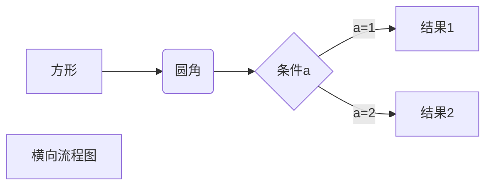
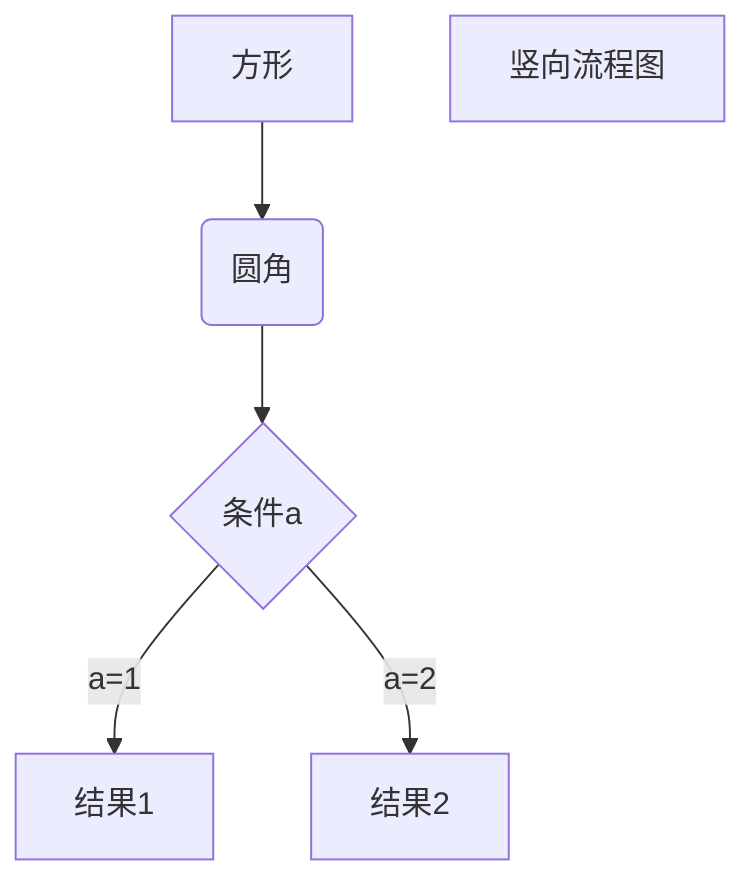
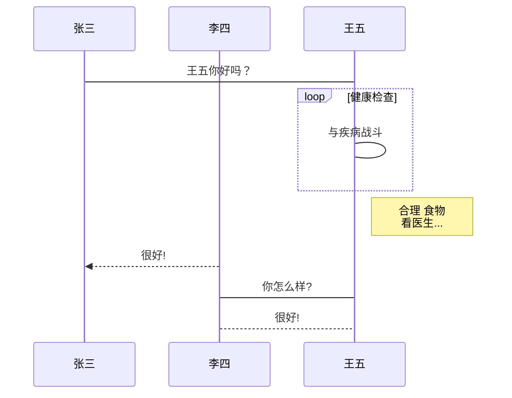
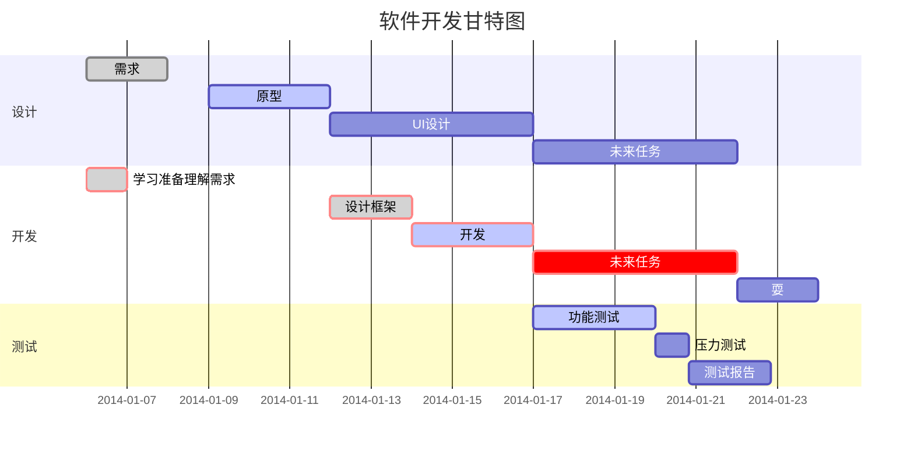

# shell 笔记


!!  执行上一次命令

变量相关：
- 设置变量(变量名和值之间不能有空格)
变量名=xxx
单引号变量，不识别特殊语法
双引号变量，识别特殊语法
test=1
aaa='{$test}'
bbb="{$test}"

- 查看变量
echo $变量名

##### 反引号 \`    ` 

ls_value=`ls`
echo $ls_value

检查系统环境变量的命令：
- set  显示所有变量
- env 只显示全局变量
- declare 输出所有变量，如同 set
- export 显示和设置环境变量

撤销环境变量
- unset 变量名，删除变量或函数
  


还有几个特殊字符用来处理参数：

| 参数处理 | 说明                                                         |
| :------- | :----------------------------------------------------------- |
| $#       | 传递到脚本的参数个数                                         |
| $*       | 以一个单字符串显示所有向脚本传递的参数。 如"$*"用「"」括起来的情况、以"$1 $2 … $n"的形式输出所有参数。 |
| $$       | 脚本运行的当前进程ID号                                       |
| $!       | 后台运行的最后一个进程的ID号                                 |
| $@       | 与$*相同，但是使用时加引号，并在引号中返回每个参数。 如"$@"用「"」括起来的情况、以"$1" "$2" … "$n" 的形式输出所有参数。 |
| $-       | 显示Shell使用的当前选项，与[set命令](https://www.runoob.com/linux/linux-comm-set.html)功能相同。 |
| $?       | 显示最后命令的退出状态。0表示没有错误，其他任何值表明有错误。 |

## 实例


$# 

$?

$n
$*
$@

$$
$!

> Dsf
>
> > dsd
> >
> > >  d
> > >
> > > > 
> > >
> > > > > f

> > d

​	<dfa

<kbd> Cmd </kbd>

<b>bbb</b>

<i> iii</i>

<em> em</em>

Sup<sup> sup </sup>

<br>br</br>b


1、横向流程图源码格式：


2、竖向流程图源码格式：


3、标准流程图源码格式：

```flow
st=>start: 开始框
op=>operation: 处理框
cond=>condition: 判断框(是或否?)
sub1=>subroutine: 子流程
io=>inputoutput: 输入输出框
e=>end: 结束框
st->op->cond
cond(yes)->io->e
cond(no)->sub1(right)->op
```
4、标准流程图源码格式（横向）：

```flow
st=>start: 开始框
op=>operation: 处理框
cond=>condition: 判断框(是或否?)
sub1=>subroutine: 子流程
io=>inputoutput: 输入输出框
e=>end: 结束框
st(right)->op(right)->cond
cond(yes)->io(bottom)->e
cond(no)->sub1(right)->op
```
5、UML时序图源码样例：

```sequence
对象A->对象B: 对象B你好吗?（请求）
Note right of 对象B: 对象B的描述
Note left of 对象A: 对象A的描述(提示)
对象B-->对象A: 我很好(响应)
对象A->对象B: 你真的好吗？
```
6、UML时序图源码复杂样例：

```sequence
Title: 标题：复杂使用
对象A->对象B: 对象B你好吗?（请求）
Note right of 对象B: 对象B的描述
Note left of 对象A: 对象A的描述(提示)
对象B-->对象A: 我很好(响应)
对象B->小三: 你好吗
小三-->>对象A: 对象B找我了
对象A->对象B: 你真的好吗？
Note over 小三,对象B: 我们是朋友
participant C
Note right of C: 没人陪我玩
```
7、UML标准时序图样例：


8、甘特图样例：


效果图如下：